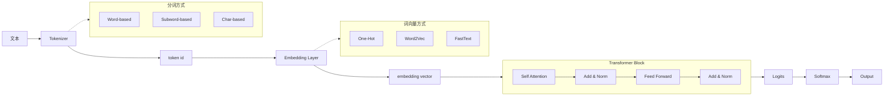

>经过快一个月的学习，我对于大模型已经有了相当初步的了解，从最基础的self-attention到整体的transformer，从预处理的tokenizer到后处理的normalization。温故而知新，今天小结一下所有学到的知识。

## self-attention
### 基础介绍
自注意力机制是现代大模型的核心，他是将原始的输入$X$向量分别乘上对应的$W_q、W_k、W_v$（这三个都是通过训练得到的权重值）得到对应的$Q、K、V$。
最终的输出ouput：
$$
\begin{align}
output &= softmax(score)V \\
&=softmax(\frac{Q K^T}{\sqrt{d_k}})
\end{align}
$$
自注意力机制的本质就是**让序列中所有的位置，都会根据自身的内容，动态的从序列中其他位置获取信息。**
其中的$\sqrt{d_k}$就是为了防止softmax接受到的值过于尖锐。如果没有除这个$\sqrt{d_k}$，很容易出现，softmax接收到要么过大的数字，要么过小的数字，导致有些位置无限接近于1，有些无限接近于0，导致梯度消失，而且自注意力机制更新网络参数就是通过梯度来实现的。
### 存在问题
很明显，现在的self-attention不会关注某个向量的位置信息，导致位置信息的丢失，所以需要改进的点之一就是添加位置编码，这个在后面会详细介绍。

## transformer
下面是手绘tranformer架构图：

以上中的多头注意力+叠加归一化+前向传递+叠加归一化，不是执行一次，而是N次。

- Tokenizer 把文本切成 token，并映射成 token id。
- Token id 只是编号，必须通过 embedding matrix 变成向量。
- Self-attention 让每个 token 根据上下文动态聚合信息。
- Q/K/V 分别表示查询、匹配特征和被汇总内容。
- Multi-head attention 是多个 attention 视角并行学习。
- Causal attention 防止生成模型看到未来 token。
- Position encoding / RoPE 给模型提供顺序信息。
- FFN 对每个 token 的表示做非线性变换。
- Normalization 和 residual 让深层 Transformer 更稳定训练。
- Decoding 决定模型如何从概率分布里选择下一个 token

## Q&A
1. 从文本输入到 next token 输出，完整流程是什么？
	先经过tokenizer得到token id，再经过embedding layer得到embedding vector，输入到transformer，再经过logits，经过softmax和decoding得到下一个token。
2. Q、K、V 分别是什么角色？
	Q是当前token想要查找什么信息，K是当前token能提供什么匹配特征，V是token能提供的内容
3. 为什么 GPT 要用 causal mask？
	因为对于生成式的模型，如果提前知道后续的内容，就是导致模型训练效果变差
4. multi-head 和 causal 是什么关系？
	多头注意力是指模型从多个角度去关注问题，causal是标志模型是否需要mask
5. token embedding 和 RAG embedding 有什么区别？
	token embedding是让token能在模型内部之间理解，RAG embedding是用于对知识库生成向量并进行检索。
6. 为什么 Transformer 需要位置编码？
	因为自注意力机制本身是不关注每个token的位置的，但是语句本身不同顺序表明的语义是不同的。
7. PreNorm 为什么比 PostNorm 更容易训练深层模型？
	
8. top-k、top-p、temperature 分别控制生成的什么特性？
	不知道

1-6 都可以过。小修 Q3：

不是“提前知道后续内容会导致训练效果变差”，而是：

> 如果训练时能看到未来 token，模型会偷看答案，loss 会虚假变好；但推理生成时没有未来 token 可看，导致训练和推理条件不一致。

Q7 可以这样答：

> PreNorm 把 Norm 放在 Attention/FFN 前面，残差连接更接近一条直接的 identity path：`x -> x + sublayer(norm(x))`。这样梯度可以更顺畅地沿着残差路径从深层传回浅层，所以深层 Transformer 更容易稳定训练。PostNorm 是 `norm(x + sublayer(x))`，残差路径每层都被 Norm 包住，对初始化和学习率更敏感。

Q8 记这一版就够用：

- **temperature**：控制概率分布的尖锐程度。
    
    - 低温：更保守，更容易选高概率 token。
    - 高温：更随机，更有创造性，也更容易跑偏。
- **top-k**：只保留概率最高的 `k` 个 token，再从里面采样。
    
    - `k` 小：选择范围窄，更稳定。
    - `k` 大：选择范围宽，更多样。
- **top-p**：保留累计概率达到 `p` 的最小 token 集合，再从里面采样。
    
    - `p` 小：只保留最核心候选。
    - `p` 大：允许更多低概率候选。
    - 它比 top-k 更动态，因为候选数量会随概率分布变化。

一句话：

> temperature 调整概率分布形状，top-k 固定候选数量，top-p 固定候选累计概率。

