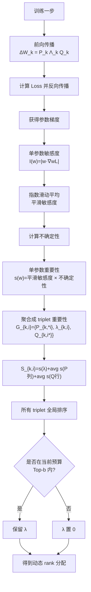
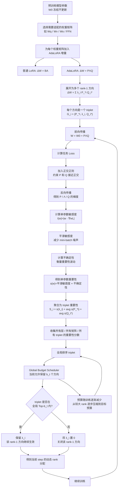

+++
title = "模型微调"
date = 2026-06-18T10:15:31+08:00
draft = false
path = "notes/模型微调"

[taxonomies]
tags = ["llm", "ai", "learning"]

[extra]
math = true
hide_from_home = false
+++
>模型后处理，对于大模型的应用，对于不同的特定场景，往往会有不同的能力需求，此时后处理（微调）就显得很有必要了。

## LoRA
对于每一个任务，如果都需要从头训练大模型，那产生的**成本**往往是过量的，不光是训练的算力和时间成本，为了防止出现过拟合，从头训练大模型也需要大量的数据。于是便有人提出了这个方法LoRA，低成本的微调大模型。
**Prompt的质量和多样性**远比数量重要，全量微调一个30B量级的base model只需要10w条数据即可，lora微调一个30B的大约需要2w条。
### 方法介绍
LoRA是在模型的关键层（多头注意力或者forward feed）上添加一个低秩矩阵，将其添加到原始权重矩阵上，该方法不需要改变整个模型的结构，在推理的时候也**不需要额外的计算量**，并能**保持原始的性能**。
$$
W=W_0+BA
$$
其中$B \in \mathbb{R}^{d\times r}$，$A\in \mathbb{R}^{r\times k}$，可以得到BA的$rank(BA) \leqslant r$ 。通过训练A和B矩阵来对模型进行微调。
<!-- R2：已上传 01-lora-low-rank-patch.png -->


### 为什么需要参数少
将设W是4096* 4096的矩阵，设定上面的r为8，如果要训练完整的一层，则需要16777216个参数，而通过LoRA来微调，就只需要训练那个添加的低秩矩阵。总参数为$4096\times 9+9\times 4096=65536$个参数。参数直接锐减了很多。
<!-- R2：已上传 02-fewer-trainable-parameters.png -->


完整的公式应该是这样的：
$$W=W_0+\frac{\alpha}{r}BA$$
其中r是上面的低秩矩阵的秩，而$\alpha$是超参数，用于控制LoRA对模型的*修改力度*。
这也就是LoRA的巧妙之处。
就是可以**使用少的多的参数构造一个尺寸和原权重一样的，但是自由度被限制在低秩空间的更新矩阵**。

这个表中可以看到，哪怕r取得很小，模型的准确率保持的还是很高的。
### r如何设置
r控制的是LoRA的**表达能力**，r 越大，LoRA 能学的变化越复杂，但参数更多、显存更高、也更容易过拟合。r 越小，参数更少、更省，但表达能力受限。
总结就是一句话，模型需要解决的任务越复杂就需要越大的r，反之则越小的r。
最常用的参数就是：
$$
r=8,\alpha=16
$$
<!-- R2：已上传 03-rank-tradeoff.png -->


---
## AdaLoRA
[AdaLoRA: Adaptive Budget Allocation for Parameter-Efficient Fine-Tuning](https://arxiv.org/abs/2303.10512)
即Adaptive LoRA，原本的LoRA的r都是由人手动设置的，但是对于每个层可能需要的r都不一样。有些层相对重要，就应该分配更大的r，有些层则应该分配更小的r。
### 方法介绍
普通的LoRA计算公式是这样的：$W=W_0+BA$，但是AdaLoRA是这样的：
$$\begin{align}W=W_0+P\Lambda Q \\
P \in \mathbb{R}^{d_1\times r} \\
Q\in \mathbb{R}^{r\times d_1}\\
\Lambda \in \mathbb{R}^{r\times r}
\end{align}
$$
其中$\Lambda$是：
$$
\Lambda =diag(\lambda_1,\lambda_2 \dots \lambda_r)
$$
此处使用了奇异值分解（SVD），AdaLoRA并没有说觉得哪个层的权重不重要，就把那一层删掉，而是把其中的$\Lambda$对应行的$\lambda$置零，后续如果发现被误判了重要性，还可以把它恢复过来。
	奇异值分解（Singular Value Decomposition，简称 SVD）是线性代数中**最重要**的矩阵分解方法之一。可以把它理解为“**矩阵的极坐标表示**”——任何矩阵都能被**分解成三个简单矩阵的乘积。**
$$
\begin{align}
P\Lambda Q&=\sum_{i=1}^{r}\lambda_i P_{*,i}Q_{i,*}\\
&=\lambda_1P_{*,1}Q_{1,*}+\lambda_2 P_{*,2}Q_{2,*}+\dots +\lambda_rP_{*,r}Q_{r,*}
\end{align}
$$
在原论文中这样的三个变量组合起来，叫做triplet。如下：
$$
G_i=\{P_{*,i},\lambda_i,Q_{i,*}\}
$$
就是一个奇异值，左奇异向量，右奇异向量的组合。
然后如果要降低rank，就把某个$\lambda_i$置0。
### 降低rank方法
就如上面所说，adalora要降低rank，就是将不那么重要的triplet对应的lambda去掉。将某个lambda置0，则反映到$P\Lambda Q$是降低了他的rank（秩）。
该方法没有直接把P或者Q删除，而是将其对应方向的$\lambda$设置为0，AdaLoRA 只 **mask 掉奇异值**，**保留奇异向量**，这样被误剪掉的方向后面还**有恢复可能**；相比直接剪掉 LoRA 的 doublet，训练会**更稳定**。
<!-- R2：已上传 04-adalora-reversible-pruning.png -->


### 评价方法
那么我们应该如何评价这样的参数对于原本的权重矩阵有没有影响呢，如何衡量呢。
最简单的方法就是直接看对应的奇异值大小，如果奇异值越大，则认为该triplet越重要。公式如下：
$$
S_{k,i}=|\lambda_{k,i}|
$$
但这样很明显是不准确的。
原论文中给了这样的公式：
$$
S_{k,i}=S(\lambda_{k,i})+\frac{1}{d_1}\sum_{j=1}^{d_1}S(P_{k,ji})+\frac{1}{d_2}\sum_{j=1}^{d_2}S(Q_{k,ij})
$$
其中:
$$
\begin{align}
S(\omega_{ij})&=\overline{I}(\omega_{ij})U(\omega_{ij})\\
&=|\omega_{ij}\nabla_\omega \mathcal{L}|U(\omega_{ij})
\end{align}
$$
逐步解释一下，其中的$\nabla\mathcal{L}$是loss对$\omega$的梯度，表明如果把这个参数删掉，**loss 大概会变化多少**。AdaLoRA 借鉴了剪枝里的思想：  
如果把某个参数置 0，会让 loss 变化很大，那这个参数就重要。
而$\overline{I}$表明此处做的是平滑敏感度，即
$$\overline{I}(t)(w)=β1​\overline{I}(t−1)(w)+(1−β1​)I(t)(w)$$
如果：
$$\beta_1=0.85$$
那么新的平滑分数大概是：
$$85\%旧历史+15\%当前 batch
$$
这样可以避免因为某一个 batch 的偶然性而误判重要性。
而$U(\omega_{ij})$是uncertainty term，用局部变化来量化不确定性。

两者相乘，表明了我们这个式子是想得到**既敏感，又值得关注的参数**。

### 全局分配器
adalora原论文标题中还强调了*BUDGET ALLOCATION*，他是如何实现的呢。就是通过其独特的全局分配器。
全局分配器负责决定：当前训练阶段，全模型一共允许保留多少个低秩方向；Top-b 负责决定：具体保留哪些方向。
top-b的b就是从所有矩阵的所有triplet中选择最大的b个triplet保留下来。
全局分配器，调度的就是这个$b^{t}$，也就是当前训练step 为t的时候，允许保留的b个triplet。
AdaLoRA 通常是：
一开始预算比较大，允许保留更多 triplet；
中间**逐渐减少预算**，慢慢压缩 rank；
最后到达目标预算，固定下来继续训练。

<!-- R2：已上传 05-global-budget-scheduler-v2.png -->


	为什么要这样设计呢？因为一开如果设置很小的triplet，很容易误删很多后面有用的triplet。
整个AdaLoRA的流程如下：


### 优缺点
优点：
1. rank分配更合理
2. 同样参数量下，效果更好
3. 可以自动发现哪些层更重要
缺点：
4. 训练流程复杂很多
5. 超参数多
6. 训练开销更大
---
## QLoRA
QLoRA即Quant LoRA，Quant就是量化的意思，顾名思义，这个方法是通过量化的手段在LoRA的基础上继续降低占用。
### 模型量化
模型量化就是模型的低精度表示，即在不降低模型效果的前提下，用更低的精度来来表示模型的参数，从而缩减模型体积和训练模型时候的内存占用。
	通过QLoRA能实现本地（单张48GB GPU）训练65B的模型，65B的模型光权重就要130GB。

|精度|每参数|7B 权重大致占用|
|---|--:|--:|
|FP32|4 bytes|28 GB|
|FP16/BF16|2 bytes|14 GB|
|INT8|1 byte|7 GB|
|INT4/NF4|0.5 byte|3.5 GB 左右|
原本模型可能是使用FP32存的，但是可以把它讲到INT8来存，这样就能降低很大的模型内存占用。
	我的本科毕设事实上也就是一个模型量化的项目，把原本的RAFT-stereo模型从FP32量化成FP16。参见[这个项目](https://github.com/somnus0917/RAFT-Stereo)和[这个文章](https://blog.somnus.top/p/raft%E8%AE%AD%E7%BB%83%E6%97%A5%E5%BF%972/)
### 问题背景
为什么需要QLoRA呢，原本LoRA不是已经只关心那个新加的低秩矩阵吗？
回顾刚才上面的LoRA。
$$W=W_0+BA$$
因为随着现代模型越来越大，$W$这个权重已经变得非常大，比如上面提到的65B，模型权重体积就能达到130GB，家用显卡根本不可能能装下，连基础权重模型文件都装不下的话就别提其他的了。
### 核心公式
QLoRA的核心公式就是如下：
$$
\begin{align}
W_q={Quant}(W) \\
\hat{W}=Dequant(W_q)
\end{align}
$$
在QLoRA中将冻结的原始权重W量化成，压缩得到$W_q$，在真正计算的时候再将其解量化。
- 基座模型：冻结，并且用**4-bit**存储
- LoRA：用**FP16或者BF16**存储。

<!-- R2：已上传 06-qlora-quantized-base.png -->


### 关键设计
如果只是直接的使用我的毕业设计的量化方式（直接`new_state_dict[key] = value.half()`😅），那样的话整个模型的效果肯定不好，很多有效的信息都会被丢失掉，于是论文作者提出了下面三项关键设计。
#### NF4
解决的问题是，怎样让4-bit量化得尽量不伤模型，也就是尽量保证有效信息的传递。
普通的INT4会把一个数值范围均匀的分成16段，然而大模型的权重并不是均匀分布的，而是接近于**正态分布的**，大部分权重集中在0左右。
若依旧均匀量化，就会发生：
- 0 附近最密集、最重要的数值，分辨率不够；
- 两端稀少的极端值，反而浪费很多编码格子。
实际的量化过程会按照block来实现，每64个权重会共享一个缩放值c：
$$W_{\text{block}} \xrightarrow{\text{absmax normalize}} \frac{W_{\text{block}}}{c} \xrightarrow{\text{NF4}} q$$
存储时保存：
- 每个权重的 4-bit NF4 索引；
- 每个 block 的 scale c。
例子：
论文中是通过这样的方式来得到这样的正态分布NF4表Q。
```python
from scipy.stats import norm
import torch
def create_normal_map(offset=0.9677083, use_extra_value=True):
    if use_extra_value:
        # one more positive value, this is an asymmetric type
        v1 = norm.ppf(torch.linspace(offset, 0.5, 9)[:-1]).tolist() # 正数部分
        v2 = [0]*(256-15) ## we have 15 non-zero values in this data type
        v3 = (-norm.ppf(torch.linspace(offset, 0.5, 8)[:-1])).tolist() #负数部分
        v = v1 + v2 + v3
    else:
        v1 = norm.ppf(torch.linspace(offset, 0.5, 8)[:-1]).tolist()
        v2 = [0]*(256-14) ## we have 14 non-zero values in this data type
        v3 = (-norm.ppf(torch.linspace(offset, 0.5, 8)[:-1])).tolist()
        v = v1 + v2 + v3
    values = torch.Tensor(v)
    values = values.sort().values
    values /= values.max()
    assert values.numel() == 256
    return values

Q = create_normal_map()
Q
```
得到的Q如下，
```txt
-1.0000000000
-0.9738519258
-0.9497979294
...
0.9497979294
0.9738519258
1.0000000000
```
对于输入的权重：
```python
input_blocked_tensor = [[-1.28645003578589, -1.817660483275528, 9.889441349505042, 0.010208034676132627],
 [ -15.009014631551885, 1.4136255086268115, -7.815595761491153, 10.766760590950263],
 [-0.731406153917959, 3.468224595908726, 2.445252541840315, -8.970824523299282],
 [-9.641638854625175, 7.696158363188889, -5.323939281255154, 5.97160401402024]]
```
根据每一块的特征值的绝对值的最大值，保存为量化常数。
```python
c1 = max(|-1.28645003578589|, |-1.817660483275528|, |9.889441349505042|, |0.010208034676132627|) = 9.889441349505042
c2 = max(|-15.009014631551885|, |1.4136255086268115|, |-7.815595761491153|, |10.766760590950263|) = 15.009014631551885
c3 = max(|-0.731406153917959|, |3.468224595908726|, |2.445252541840315|, |-8.970824523299282|) = 8.970824523299282
c4 = max(|-9.641638854625175|, |7.696158363188889|, |-5.323939281255154|, |5.97160401402024|) = 9.641638854625175
```
对于第一个权重参数`-1.28645003578589`让他除以这一块的权重参数`9.889441349505042`，得到`-0.13008318572517502`，再在Q中找到最接近的值`-0.09105003625154495`，得到其在Q中的索引为6（假设）。然后权重参数矩阵就可以转换成索引值矩阵。
```python
[[6, 5, 15, 7],
[0, 8, 2, 14],
[6, 11, 10, 0],
[0, 14, 2, 13]]
```
在反量化（解量化时），再根据这个索引找到对应的值矩阵，再乘上每一块对应的权重参数得到反量化后的权重参数矩阵。
```python
[[-0.9004339933799617, -1.8273060011889755, 9.889441349505042, 0.0],
 [-15.009014631551885, 1.1944218804231184,  -7.880829111886221,  10.850869732860506],
 [-0.816793898052648, 3.0313783372030603, 2.2078302737800004, -8.970824523299282],
 [-9.641638854625175, 6.970488722350373, -5.062564734402345, 5.424549965245643]]
```
可以看到，参数是肯定不一样的，这就是必然的精度损失，但是只要不影响模型效果，就可以。
我们在这个过程中，保存的就是索引值矩阵，和对应每个块的权重参数`cn`。可以注意到索引值矩阵是4-bit但是这个c权重参数是FP32的。
#### 双重量化
按照上面所说，我们如果按照FP32保存权重参数，在QLoRA中每个块的大小是64，每个块中的每个值是4比特，那么为了存这个权重参数就需要额外占用$32/(64\times 4) = 12.5\%$ 的显存。若每 64 个权重共享一个 FP32 scale（权重参数），则 scale 的平均额外成本是：
$$
\frac{32}{64}=0.5\text{ bit/parameter}
$$
作者在此处提出了对这个scale数再进行一次8bit的量化，QLoRA以每256个量化常数为一组再做一次量化，此时他产生的占用就有两部分组成，第一次的scale经过8bit得到的常数和对scale进行量化得到的new scale。此时需要**额外占用**$8/(64\times 4)+32/(256\times 64\times 4)=3.174 \%$，论文给出的平均节省约为 $0.373 \text{bit/parameter}$。65B 模型上，这仍然是数 GB 的差距。
因为使用了双重量化，在进行反量化时我们也需要进行**两次反量化**才能把量化后的值还原。
#### Paged Optimizer(分页优化)
训练显存不只是权重，还包括：
- 激活值；
- 梯度；
- LoRA 的 optimizer states；
- 临时张量；
- 不同长度样本造成的显存波动。
尤其是长上下文、长指令样本进来时，显存可能突然高一截，导致训练直接 **OOM**。
Paged Optimizer 使用 *NVIDIA Unified Memory*，把一部分不那么急需驻留在显存中的优化器状态换出到 CPU 内存，需要时再调回。它更像一个*显存缓冲机制*：
- 正常时尽量在 GPU 内；
- 显存峰值时向 CPU 内存借空间；
- 代价是发生换页时训练可能变慢。
它不是 QLoRA 质量提升的主要来源，却让实际**训练稳定很多**。

<!-- R2：已上传 07-qlora-paged-optimizer.png -->


### 与LoRA对比
| 方面           | LoRA         | QLoRA        |
| ------------ | ------------ | ------------ |
| 基座权重存储       | 通常 FP16/BF16 | 通常 NF4 4-bit |
| 基座模型是否更新     | 不更新          | 不更新          |
| LoRA adapter | BF16/FP16 训练 | BF16/FP16 训练 |
| 显存瓶颈         | 仍须放下完整基座模型   | 基座权重显存大幅降低   |
| 适合场景         | 7B/13B 或显存充足 | 显存紧张、想微调更大模型 |
| 训练速度         | 通常更直接        | 需量化/解量化，未必更快 |
### 为什么质量还能接近全参数微调？
1. QLoRA的LoRA本质没有变，还是在原始模型权重的基础上增加一个相对低秩的任务增量。
2. NF4 带来了量化误差，但这个误差没有大到让原模型能力崩掉。

## 其他LoRA变种
### X-LoRA
X-LoRA：采用了MOE的思路，对每个token经过多个expert，额外训练多一个scaling network，通过输出的scaling对每个expert的输出进行加权
[原论文](https://arxiv.org/abs/2402.07148)
X-LoRA相当于调用不同的多个LoRA来处理同一个token，普通的LoRA如下：
$$
W=W_0+\Delta W
$$
而X-LoRA则是这样的：
$$
W=W_0+\sum_{i=1}^ns_i(x,l,t)\Delta W_i
$$
其中，$s_i(x,l,t)$是指模型针对$x$的输入，第$l$层，第$t$个token动态算出来的权重。
优点：能让模型有更强的组合能力，不同的LoRA会增强气不同领域的能力。同样的，相对于重新训练模型，X-LoRA还是更节省的方案。
缺点：毕竟有多个专家LoRA，推理速度自然就比单LoRA慢，显存和带宽压力也会变大。不同 LoRA 若基座、训练方式、目标冲突严重，混用可能互相干扰。

### LoHa
在LoRA的基础上引入了hadamard product，可以理解为对LoRA的更有创造力的改造。
LoRA的公式如下：
$$
W=W_0+BA
$$
其中的BA是两个低秩矩阵相乘。而LoHa则是：
$$W=W_0+(B_1A_1)\odot(B_2A_2)$$
其中的$\odot$就是hadamard product，即同一位置的元素相乘。
原本的LoRA计算的有效秩是$r$，经过哈马达乘积之后的有效秩就是$r^2$。
很明显，我们可以注意到，经过这样的乘积，微调需要的计算量肯定会变大，而且变大不少，但是相对于原本基础模型仍然不算大。
> LoHa 仍坚持“冻结大模型、只训练少量参数”的 PEFT 本质；但放弃了 LoRA 最漂亮的性质之一：更新本身低秩、且可用两次小矩阵乘法高效计算。它用**更多训练时计算**，换取更强的**更新表达能力**。


## Q&A
### LoRA
- Full fine-tuning 和 PEFT 的区别是什么？
fullfine-tuning是全量微调，PEFT是高效微调，区别是修改的参数量的多少
- LoRA 为什么叫 low-rank adaptation？
low-rank adaptation是低秩调节，是指在模型的关键层添加一个低秩矩阵来对模型进行微调
- LoRA 中原始权重 `W` 会不会训练？
不会
- `ΔW = BA` 里的 `A / B / r` 分别是什么？
A和B就是两个低秩举证，r是他们的秩
- LoRA 通常插在 Transformer 的哪些层？
多头注意力层和前向传播层
- 为什么 LoRA 训练后可以合并回原模型权重？
因为他的BA的格式和W是一致的
- LoRA 的优点和局限分别是什么？
优点：训练高效，算力需求小。
缺点：参数r需要自己设置，而且每一层的r默认相同（adalora解决了这个问题）

---
- Q2：不是“添加一个低秩矩阵”，更准确是添加两个小矩阵 `A` 和 `B`，用它们的乘积近似一个低秩增量：

```
W' = W + ΔW
ΔW = B A
```

- Q4：`A/B` 不是“两个低秩矩阵”。通常 `A` 和 `B` 本身是小矩阵，关键是它们的乘积 `BA` 的秩最多为 `r`，所以 `ΔW` 是低秩的。`r` 是 LoRA rank，控制新增参数量和适配能力。
    
- Q5：对。常见是 attention 里的 `q_proj / k_proj / v_proj / o_proj`，也可以放到 FFN 的 `up_proj / down_proj / gate_proj` 等线性层。
    
- Q6：对，因为 `BA` 的形状和原权重 `W` 一样，所以推理前可以做：

```
W_merged = W + BA
```

- Q7：你提到 AdaLoRA 很好。再补两个常见局限：
    - 不是所有任务都能用很小的 rank 适配好，复杂任务可能需要更高 rank 或更多插入层。
    - 对数据质量仍然敏感，LoRA 只降低训练成本，不自动解决过拟合、灾难性遗忘或指令数据质量问题。

### QLoRA
- QLoRA 和 LoRA 的核心区别是什么？
核心区别是QLoRA在LoRA的基础上还实现了对原始参数的量化，方便大模型在小显存机器上进行训练
- QLoRA 里 base model 会不会训练？
不会训练，本质和LoRA一样，都是通过添加低秩矩阵对模型进行微调。
- 为什么 4-bit 量化能显著降低显存？
因为4-bit存储就是会比原本的FP32和FP16节约很多存储空间
- NF4 是什么？为什么适合模型权重？
NF4是一种4-bit量化的数据结构方式，因为权重参数据观察大部分都是符合正态分布的，也就是靠近0参数越来越多，而NF4同样也是靠近0的量化点越来越多，这样可以尽量保留有效信息。
- Double Quantization 解决什么问题？
解决的是量化本身的scale也就是量化常数的存储问题，也就是在原本的量化的基础上，对量化常数在进行一次Quant。
- Paged Optimizer 解决什么问题？
防止一些长上下文等参数进入显存导致oom，他利用的是临时借用cpu内存。
- QLoRA 的优点和局限分别是什么？
优点，让大模型的微调的硬件成本进一步降低。
缺点，多少会有点信息丢失。

---
- Q1 对。更精确说：**QLoRA = 4-bit quantized frozen base model + trainable LoRA adapters**。它不是把 LoRA 参数也全都 4-bit 训练，LoRA adapter 通常仍以较高精度训练。
    
- Q3 对。补个比例：FP16 是 16 bit，4-bit 权重理论上只有它的 `1/4`；FP32 则是 `1/8`。实际还会有量化常数、optimizer states、activation 等开销，所以不是总显存严格降到 1/4。
    
- Q5 很好。“再进行一次 Quant”可以写成：对第一次量化用到的 scale/quantization constants 再量化，减少额外存储开销。
    
- Q6 对，不过“长上下文等参数进入显存”可以更准一点：Paged Optimizer 主要解决 **optimizer states / 梯度检查点等训练中显存峰值突然升高** 的问题，通过 unified memory 在 GPU/CPU 间分页，降低 OOM 风险。
    
- Q7 补两个局限：
    
    - 量化会带来一定精度损失，极端任务或高精度场景可能不如 FP16/BF16 LoRA。
    - 训练速度不一定更快，有时量化/反量化和分页会带来额外开销。
    - 硬件和框架支持也会影响体验，比如 bitsandbytes、CUDA、显卡架构。