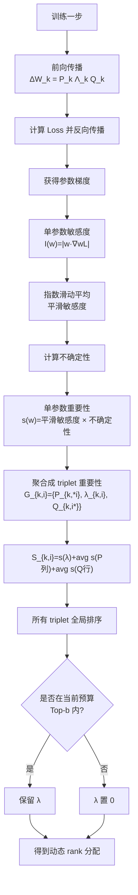
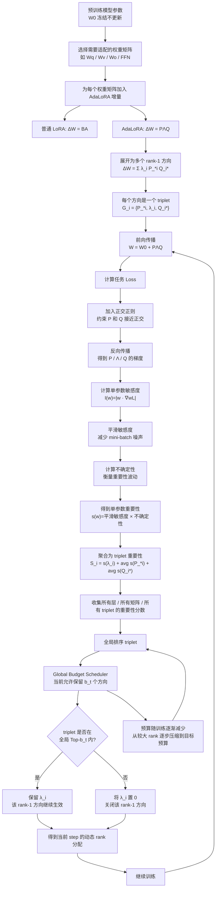

>模型后处理，对于大模型的应用，对于不同的特定场景，往往会有不同的能力需求，此时后处理（微调）就显得很有必要了。

## LoRA
对于每一个任务，如果都需要从头训练大模型，那产生的**成本**往往是过量的，不光是训练的算力和时间成本，为了防止出现过拟合，从头训练大模型也需要大量的数据。于是便有人提出了这个方法LoRA，低成本的微调大模型。
**Prompt的质量和多样性**远比数量重要，全量微调一个30B量级的base model只需要10w条数据即可，lora微调一个30B的大约需要2w条。
### 方法介绍
LoRA是在模型的关键层（多头注意力或者forward feed）上添加一个低秩矩阵，将其添加到原始权重矩阵上，该方法不需要改变整个模型的结构，在推理的时候也**不需要额外的计算量**，并能**保持原始的性能**。
$$
W=W_0+BA
$$
其中$B \in \mathbb{R}^{d\times r}$，$A\in \mathbb{R}^{r\times k}$，可以得到BA的$rank(BA) \leqslant r$ 。通过训练A和B矩阵来对模型进行微调。

### 为什么需要参数少
将设W是4096* 4096的矩阵，设定上面的r为8，如果要训练完整的一层，则需要16777216个参数，而通过LoRA来微调，就只需要训练那个添加的低秩矩阵。总参数为$4096\times 9+9\times 4096=65536$个参数。参数直接锐减了很多。
完整的公式应该是这样的：
$$W=W_0+\frac{\alpha}{r}BA$$
其中r是上面的低秩矩阵的秩，而$\alpha$是超参数，用于控制LoRA对模型的*修改力度*。
这也就是LoRA的巧妙之处。
就是可以**使用少的多的参数构造一个尺寸和原权重一样的，但是自由度被限制在低秩空间的更新矩阵**。

这个表中可以看到，哪怕r取得很小，模型的准确率保持的还是很高的。
### r如何设置
r控制的是LoRA的**表达能力**，r 越大，LoRA 能学的变化越复杂，但参数更多、显存更高、也更容易过拟合。r 越小，参数更少、更省，但表达能力受限。
总结就是一句话，模型需要解决的任务越复杂就需要越大的r，反之则越小的r。
最常用的参数就是：
$$
r=8,\alpha=16
$$
## AdaLoRA
[AdaLoRA: Adaptive Budget Allocation for Parameter-Efficient Fine-Tuning](https://arxiv.org/abs/2303.10512)
即Adaptive LoRA，原本的LoRA的r都是由人手动设置的，但是对于每个层可能需要的r都不一样。有些层相对重要，就应该分配更大的r，有些层则应该分配更小的r。
### 方法介绍
普通的LoRA计算公式是这样的：$W=W_0+BA$，但是AdaLoRA是这样的：
$$\begin{align}W=W_0+P\Lambda Q \\
P \in \mathbb{R}^{d_1\times r} \\
Q\in \mathbb{R}^{r\times d_1}\\
\Lambda \in \mathbb{R}^{r\times r}
\end{align}
$$
其中$\Lambda$是：
$$
\Lambda =diag(\lambda_1,\lambda_2 \dots \lambda_r)
$$
此处使用了奇异值分解（SVD），AdaLoRA并没有说觉得哪个层的权重不重要，就把那一层删掉，而是把其中的$\Lambda$对应行的$\lambda$置零，后续如果发现被误判了重要性，还可以把它恢复过来。
	奇异值分解（Singular Value Decomposition，简称 SVD）是线性代数中**最重要**的矩阵分解方法之一。可以把它理解为“**矩阵的极坐标表示**”——任何矩阵都能被**分解成三个简单矩阵的乘积。**
$$
\begin{align}
P\Lambda Q&=\sum_{i=1}^{r}\lambda_i P_{*,i}Q_{i,*}\\
&=\lambda_1P_{*,1}Q_{1,*}+\lambda_2 P_{*,2}Q_{2,*}+\dots +\lambda_rP_{*,r}Q_{r,*}
\end{align}
$$
在原论文中这样的三个变量组合起来，叫做triplet。如下：
$$
G_i=\{P_{*,i},\lambda_i,Q_{i,*}\}
$$
就是一个奇异值，左奇异向量，右奇异向量的组合。
然后如果要降低rank，就把某个$\lambda_i$置0。
### 降低rank方法
就如上面所说，adalora要降低rank，就是将不那么重要的triplet对应的lambda去掉。将某个lambda置0，则反映到$P\Lambda Q$是降低了他的rank（秩）。
该方法没有直接把P或者Q删除，而是将其对应方向的$\lambda$设置为0，AdaLoRA 只 **mask 掉奇异值**，**保留奇异向量**，这样被误剪掉的方向后面还**有恢复可能**；相比直接剪掉 LoRA 的 doublet，训练会**更稳定**。
### 评价方法
那么我们应该如何评价这样的参数对于原本的权重矩阵有没有影响呢，如何衡量呢。
最简单的方法就是直接看对应的奇异值大小，如果奇异值越大，则认为该triplet越重要。公式如下：
$$
S_{k,i}=|\lambda_{k,i}|
$$
但这样很明显是不准确的。
原论文中给了这样的公式：
$$
S_{k,i}=S(\lambda_{k,i})+\frac{1}{d_1}\sum_{j=1}^{d_1}S(P_{k,ji})+\frac{1}{d_2}\sum_{j=1}^{d_2}S(Q_{k,ij})
$$
其中:
$$
\begin{align}
S(\omega_{ij})&=\overline{I}(\omega_{ij})U(\omega_{ij})\\
&=|\omega_{ij}\nabla_\omega \mathcal{L}|U(\omega_{ij})
\end{align}
$$
逐步解释一下，其中的$\nabla\mathcal{L}$是loss对$\omega$的梯度，表明如果把这个参数删掉，**loss 大概会变化多少**。AdaLoRA 借鉴了剪枝里的思想：  
如果把某个参数置 0，会让 loss 变化很大，那这个参数就重要。
而$\overline{I}$表明此处做的是平滑敏感度，即
$$\overline{I}(t)(w)=β1​\overline{I}(t−1)(w)+(1−β1​)I(t)(w)$$
如果：
$$\beta_1=0.85$$
那么新的平滑分数大概是：
$$85\%旧历史+15\%当前 batch
$$
这样可以避免因为某一个 batch 的偶然性而误判重要性。
而$U(\omega_{ij})$是uncertainty term，用局部变化来量化不确定性。

两者相乘，表明了我们这个式子是想得到**既敏感，又值得关注的参数**。

### 全局分配器
adalora原论文标题中还强调了*BUDGET ALLOCATION*，他是如何实现的呢。就是通过其独特的全局分配器。
全局分配器负责决定：当前训练阶段，全模型一共允许保留多少个低秩方向；Top-b 负责决定：具体保留哪些方向。
top-b的b就是从所有矩阵的所有triplet中选择最大的b个triplet保留下来。
全局分配器，调度的就是这个$b^{t}$，也就是当前训练step 为t的时候，允许保留的b个triplet。
AdaLoRA 通常是：
一开始预算比较大，允许保留更多 triplet；
中间**逐渐减少预算**，慢慢压缩 rank；
最后到达目标预算，固定下来继续训练。
	为什么要这样设计呢？因为一开如果设置很小的triplet，很容易误删很多后面有用的triplet。
整个AdaLoRA的流程如下：

### 优缺点
优点：
1. rank分配更合理
2. 同样参数量下，效果更好
3. 可以自动发现哪些层更重要
缺点：
4. 训练流程复杂很多
5. 超参数多
6. 训练开销更大
## QLoRA

