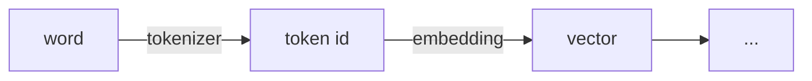
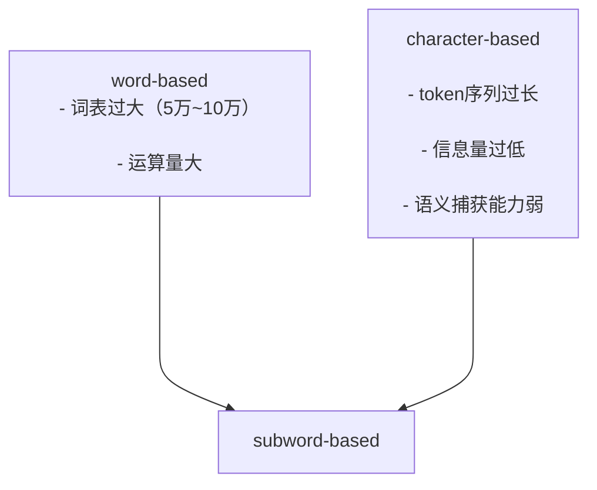
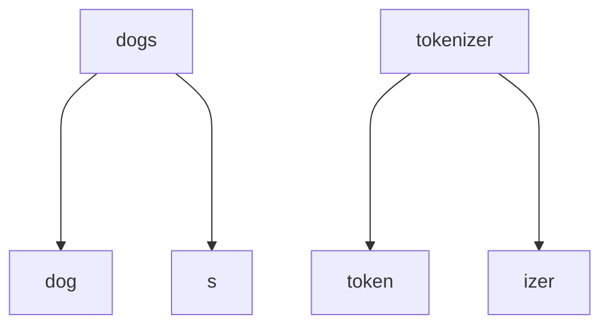

## 为什么要有tokenizer
tokenizer的作用是把文本序列转换成数字序列，即token编号，作为transformer的输入。

  

## word-based tokenizer
将文本分成一个个词，优点是表达意思准确，但是问题是很容易把同一个意思的词分成很多类，比如cat和cats就会被分成两类，按照这样的编码方式，就会导致词表巨大，因此就需要巨大的embedding\_matrix，导致空间复杂度和时间复杂度大幅上升。

  

如果限制词表的大小，比如把词表上限设为10000，就会出现很多词都无法覆盖的情况，模型性能会很差。

  

## character-based tokenizer
按照每个字母来分词，比如`"cat"`就被分为`'c','a','t'`，优点是很容易表示英文，对于英文总共可能只需要256个序号来表示，对于任意文本都不会出现unknown的现象。
缺点也是显著的，

1. 每个字母没办法代表很多的含义，信息量太低了，导致模型性能也会很差；

2. 对于中文还是需要很大的词表；

3. 相对于word-based，token序列会过于长。
## subword-based tokenizer

  

可以看到上述两种方法都有自己的缺点，而subword就是一种折中的方法。
subword划分更符合英文词群，能充分表达词意。

  

### BPE
即byte-pair encoding，主要分成两部分，词频统计和词表合并。
首先先把所有的词按character切分，得到单词表，再所有词中的两两组合的单词组合统计频率，根据频率从高到低排，取出频率最高的那个两个单词的组合，把它加到词表中。然后再按照新的词表的词两两组合（此时会有三个单词组成词组），再统计频率，再将最高频率的词组加到词表中，以此循环，知道达到超参数设定的最大循环次数。

具体流程可以看这个[视频](https://www.bilibili.com/video/BV1Fc411C7sz/)。
