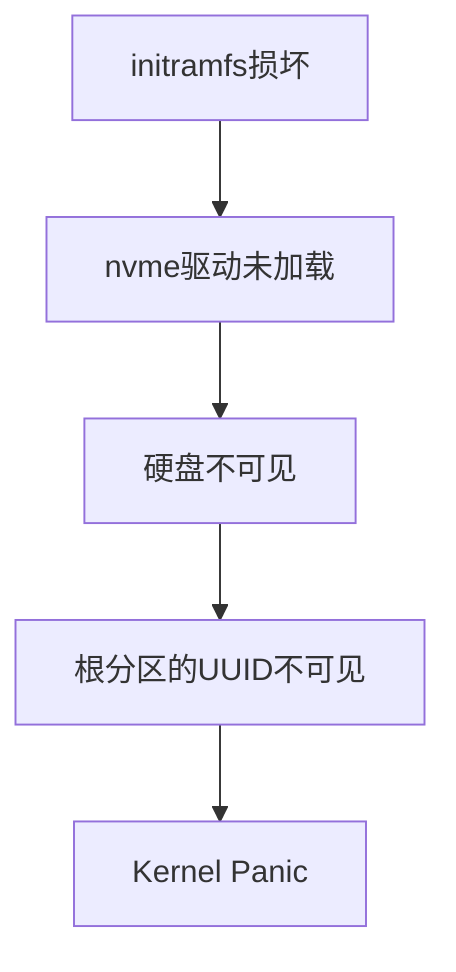
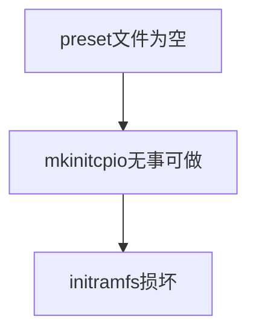
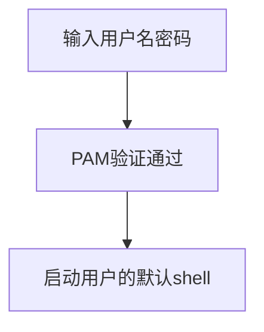

>早有耳闻archlinux系统的滚动更新，可能会有突然崩溃的情况（无违规操作）。自从回学校参加毕业典礼，大概有了三四周没有用我的惠普笔记本，回来之后我对这个笔记本进行了全面的更新，结果突然就蓝屏了，以下是我在克劳德老师的指导下的修复过程


## 原因分析
首先从这个蓝屏的报错信息中可以看到：
```
VFS: Cannot open root device "UUID=199aa68c-5125-4216-a220-6d38167d0f96" or unknown-block(0,0): error -6
Kernel panic - not syncing: VFS: Unable to mount root fs on unknown-block(0,0)
```
UUID=199aa68c-5125-4216-a220-6d38167d0f96是我的nvme0n1p9，也就是分配给双系统的cachyos使用的盘分区，他提示无法open，也就是当前没办法找到这个盘分区。内核启动的时候是需要initramfs来加载驱动包括nvme驱动btrfs驱动，如果initramfs损坏了，就会出现上面这种，知道指定的UUID（UUID信息是通过grub记录的）但是没办法打开。

当然后面发现问题其实不止这一个，我们就先从这个问题引入吧！
## 问题解决1
不管搜哪里的方案，如果你没办法进入系统终端，那么第一步永远都是找到（制作）启动盘。回忆一下之前安装的步骤，我用的是ventory制作的启动盘，选择对应的系统iso，进入live模式，然后通过`lsblk -f` 确认分区结构。

找到和上面的报错信息对应的UUID及其对应的盘符名字。
从中可以得到根分区是nvme0n1p9，efi分区是nvme0n1p7，然后将这两个盘挂载到当前的live系统中。
```bash
sudo mount -o subvol=@ /dev/nvme0n1p9 /mnt
sudo mount -o subvol=@home /dev/nvme0n1p9 /mnt/home
sudo mount /dev/nvme0n1p7 /mnt/boot/efi
```
挂载根分区是因为问题肯定主要出现在跟分区内，挂载efi是为了修复完成后更新grub。
然后通过chroot进入系统。
```bash
sudo arch-chroot /mnt
```
在接着就是重建initramfs，通过下面的指令来实现
```bash
mkinitcpio -P
```
但是问题又出现了

用于重建的preset文件是空的。由于本地存在这个文件，那么在通过`pacman -S cachyos-linux`的时候，不会更新（我因为更新cachyos-linux这个等了好久，但是更新完还是空的）。所以如果要更新，要把原本的preset文件删除，这样才会重新构建这个文件。
或者简单一点，直接手动写入内容：
```bash
cat > /etc/mkinitcpio.d/linux-cachyos.preset << 'EOF'
ALL_config="/etc/mkinitcpio.conf"
ALL_kver="/boot/vmlinuz-linux-cachyos"
PRESETS=('default' 'fallback')
default_image="/boot/initramfs-linux-cachyos.img"
fallback_image="/boot/initramfs-linux-cachyos-fallback.img"
fallback_options="-S autodetect"
EOF
```
linux-cachyos-lts一样：
```bash
cat > /etc/mkinitcpio.d/linux-cachyos-lts.preset << 'EOF'
ALL_config="/etc/mkinitcpio.conf"
ALL_kver="/boot/vmlinuz-linux-cachyos-lts"
PRESETS=('default' 'fallback')
default_image="/boot/initramfs-linux-cachyos-lts.img"
fallback_image="/boot/initramfs-linux-cachyos-lts-fallback.img"
fallback_options="-S autodetect"
EOF
```
然后`mkinitcpio -P`，这样就重新生成了包含 NVMe 驱动和 btrfs 模块的 initramfs，内核启动时才能识别硬盘。
然后更新GRUB，保证启动项指向正确的文件。
```bash
grub-mkconfig -o /boot/grub/grub.cfg
```
然后就能成功进入系统了。
## 小结1
所以问题的根源又进一步向上回溯了。

那么我们再向上刨根问底，为什么好端端的preset会为空呢？
根据claude老师的推断，应该是在更新内核的过程中，preset文件刚被创建，还没写入东西，更新程序被某个原因打断了，然后锁屏程序就崩溃了重启！然后就进不去了。
看上去这一整套链条还挺扯淡的，怎么会刚好刚创建就被打断呢，这个我也不太清楚了，可能会是什么条件触发了打断，这些对于我来说都是黑箱，没办法探究其更深层次的原因了。😩
这个据说是pacman的设计缺陷，就是没有原子性写入保证，就是会出现写了一半的中间态。
```
✅ 开始写入 linux-cachyos 包的文件
✅ vmlinuz 内核文件写入完成
❌ preset 文件只创建了空文件，内容没写进去
❌ mkinitcpio hook 没有被触发
❌ initramfs 没有重建
```
---
## 问题解决2
成功进入系统了，问题完全解决了吗？？实际上并没有，还有一个问题，就是卡在了锁屏界面，我在kde plasma登录我的somnus账号，输入密码，没有报错，但是加载了一会又给我退了出来。再试依旧退出来。然后通过`ctrl alt f1`切换到终端登录，输入somnus及密码，再次退出⏏️，又要输入用户名。由此循环往复。
后来我主动尝试了root用户，竟然可以进入。然后在root中通过这个指令来查看日志：
```zsh
journalctl -xe --no-pager | tail -50
```

从报错信息中可以看到：
```zsh
plasmashell[119953]: error: "■ ■ ■ ■ ■ PipeWire" 0
received error while creating the stream - Media monitor will not work.
```
也许是pipewire一直在报错导致进入桌面后，但是在重装pipewire后发现还是进不去。
然后在root用户中通过`su - somnus`来进入somnus用户。

由此便可以发现问题了，图片中可以看到，虽然是乱码，但是大致可以猜出来`No such file`或者`permission denied`，也就是zsh出问题了，然后通过`ls -la /usr/bin/zsh`来验证一下。

文件大小竟然是0！！输出的一行应该是：
```zsh
-rwxr-xr-x 2 root root 0 6月 2 02:44 /usr/bin/zsh
```
直接`pacman -S zsh`呢，发现并不会改变这个文件夹，文件夹的大小还是0，也就是和上面**情况一样**，安装的时候判断文件夹已经存在，就可以跳过这个文件的安装。只能执行这个`pacman -S --overwrite '*' zsh`，这会文件夹大小就正常了，`然后可以通过su - somnus`来进入somnus。此时，进入了somnus用户后，准备查看一下pipewire服务的状态，
```zsh
systemctl --user status pipewire wireplumber
```
发现问题是
```
failed to connect to user scope bus via local transport: $DBUS_SESSION_BUS_ADDRESS and $XDG_RUNTIME_DIR not define
```
因为这是通过su进入的用户，所以用户的会话环境并不完整，解决方法就是通过以下来进入somnus：
```zsh
machinectl shell somnus@
```
然后再把该启动的服务都启动
```zsh
systemctl --user enable --now pipewire pipewire-pulse wireplumber
```

最终成功进去KDE plasma！！！
## 小结2
直接导致无法进入的原因是zsh出问题了，也就是zsh在更新过程中变空了。以下是用户登录的流程。

somnus 的默认 shell 是 zsh，验证密码通过后系统尝试执行 `/usr/bin/zsh`，但这个文件是空的，进程立即退出，系统就认为"登录会话结束了"，于是直接回到登录提示符，看起来就像密码输错了一样，实际上是 shell 启动失败了。
1. 为什么 root 能登录
root 的默认 shell 是 `/bin/bash`，bash 没有损坏，所以 root 登录完全正常。
2. 为什么 zsh 会变成空文件
更新时 pacman 的写入流程大致是：
-  下载新版本 zsh
-  **先把旧文件清空/删除**
-  写入新文件内容
更新在第 2 步和第 3 步之间被中断，新内容还没写进去，文件就已经被清空了，所以留下了一个 0 字节的空壳。
看起来又是因为没有原子级写入保证的问题。

## 问题3
实际上问题并没有完全解决，lol，但是感觉确实还是学到很多了，所以最后这个问题暂时没有去解决的，我的clash verge rev出问题了，就是软件显示的画面一直都是空白的，我感觉的话，应该卸载一下重装就好了。

