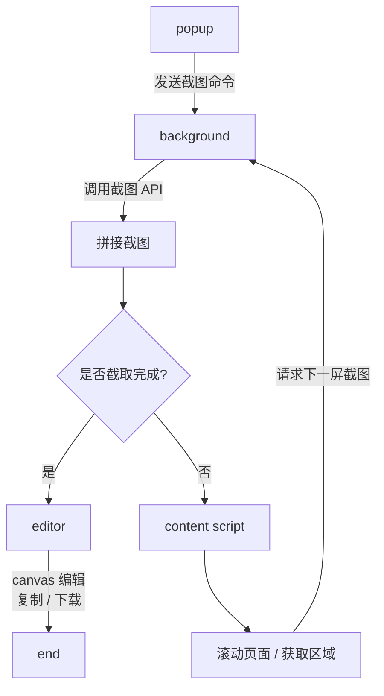
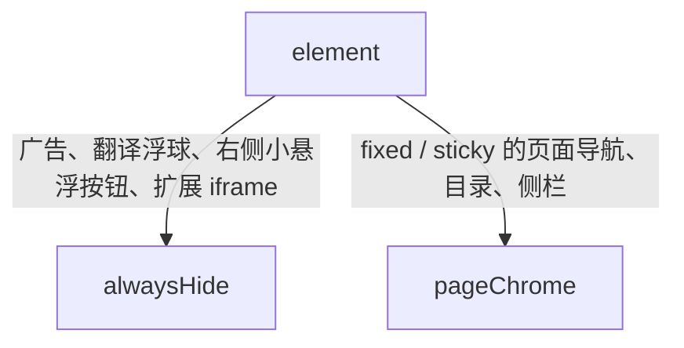

> 前情提要：我今天上午原本是在准备做一点公司的活，想办法能不能做一些比如商品价格爬虫之类的方案，然后GPT推荐我商品价格数据获取可以从京东万象数据中获取，然后我就到了京东云的官网，但是京东万象数据好像关闭服务了？？但是我注意到京东云轻量级服务器专区，有点小心动💓，但是不同型号不同标准，也不知道哪个更适合我。我准备截图发给GPT，很明显这个页面超过一页，然后mac上我也不知道怎么缩小chrome页面，然后我想到了我之前安装的gofullpage插件，于是我便使用了，他截图功能是免费的，但是编辑和截取部分页面是付费的，fk🤬于是我当时就想到可以试试自己做一个插件。

## 前期准备

说干就干，我先去问GPT了解了一下chrome浏览器插件的基础信息。
首先，现代的浏览器有着统一的浏览器配置规范，即manifest v3（v2已经几乎被全面弃用），在每个插件的根目录下都会有一个manifest.json。如果要发布到chrome插件商城，需要去开发者平台注册一个账号，还要充值5$，fffffk。暂时先不上架了。

## 工作流程

这个项目整体是基于原生的js、css、html和chrome extension api来实现的，工作流程如下图：



## 技术细节

### 全页截图拼接

由于chrome并不提供获取全页的api，于是无法通过直接调用来实现截图，所以每次的全页截图都是通过模拟拼接出来的。
通过content script获取`scrollHeight、scrollWidth、clientHeight、clientWidth`，再保存当前位置，计算每次需要停留的位置。
每次滚动并不是完全贴合，而是留出重叠部分`TILE_OVERLAP_CSS_PX`，因为如果没有重叠，每个拼接处都会有个裂缝。然后就是不断执行滚动、delay `CAPTURE_DELAY_MS = 300;`（等待渲染完成）。截图，保存子图。
最后通过canvas拼接起来。

### 过滤元素

除了拼接，还有一个很重要的点就是要过滤一些不该被重复截取的元素。比如标题栏、广告、悬浮球等等。
主要分成两个策略：



### 自定义截图

这个很简单，通过content script注入全屏遮罩，鼠标拖动生成选框，松开鼠标便得到viewpoint。然后使用background获取制定的可见区域。

### 元素截图

在截屏时为了防止误触页面，会添加一个遮罩来阻挡鼠标点击，那么怎么获取鼠标到底点击的是什么元素呢。

```javascript
overlay.style.pointerEvents = "none";
const element = document.elementFromPoint(event.clientX, event.clientY);
overlay.style.pointerEvents = "auto";
```

在获取元素的时候把遮罩取消，获取完再**立刻**恢复。如果注释上面的none这一行。
程序就会失效了。

## 难点

**这类插件最难的地方**
不是“截一张图”，而是下面这些边界：

- Retina / 缩放比例导致坐标偏移
- captureVisibleTab 频率限制
- 页面懒加载导致截图内容变化
- sticky/fixed 元素重复
- 无限滚动页面没有终点
- 超长截图 Canvas 内存爆
- 广告/浮球/扩展 iframe 难以统一识别
- chrome://、扩展页面、商店页面无法截图
- 剪贴板/分享 API 在不同浏览器支持不一致
  所以这个项目的技术核心其实是：

```text
浏览器扩展权限模型 + content/background 消息编排 + 滚动分块截图 + Canvas 坐标映射和图像处理 + 大量网页兼容性兜底
```

## 思考回顾

从前情提要开始，脑子中灵感的迸发，让我感觉在这个时代真正重要的，也许真的不再是你能写怎样的代码，也许更应该关注于，你要写什么，你想要得到什么。就像我这个项目一样，从有想法，到落地，不过就是一天的时间，如果没有这种工具思维，在面对需要付费的小工具的时候，我可能就会直接掏钱了（虽然很便宜，好像就1$一个月），但是这样一段小的工具项目，也能让我知道不少东西，比如插件的发布流程，js、html、css传统三件套的配合、canvas的用处、chrome的api式的架构等等。
所以我觉得在这个ai爆发的时代，一定要多去想，多去做，多去了解，不管怎样的架构，都去了解一下，这样在面对真正的问题的时候，曾经项目的灵感也会救你（我）一命。
共勉！
