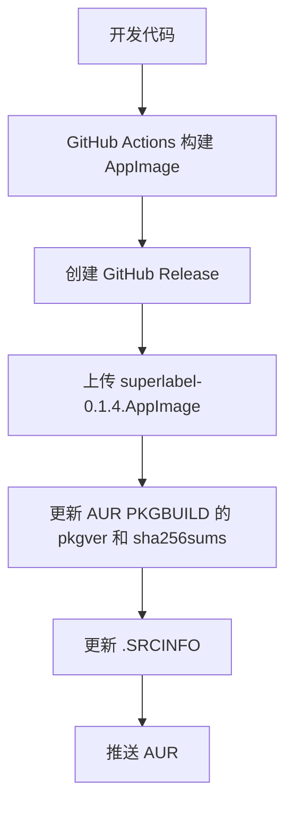

+++
title = "第一次打包aur"
date = 2026-06-10T14:48:22+08:00
draft = false
path = "p/第一次打包aur"

[taxonomies]
tags = ["linux", "Tool"]

[extra]
math = true
hide_from_home = false
+++
> 最近组里面给了一个图像标注的任务，但是我现在的主力电脑是mac，我在网上搜罗好用的mac上的标注软件，像很出名的开源软件labelimg和labeling都没有对应的mac版本，mac的appstore上的rectlabel，又是付费软件，就是会一直弹广告，虽然在标注的时候忍忍就过来了，但是我还是想做一个免费开源跨平台的标注软件，最好还能基于rust，不过这篇博客不介绍我的superlabel，而是介绍把软件发布到archlinux的aur中的教程。

## 初步介绍

我们在aur上找软件的时候会发现，在软件名后面，通常会有-bin -git的后缀。

在这里介绍一些常见的后缀代表的含义：

- -bin：表示安装的是作者已经编译好的二进制文件。
- -git：表示从 Git 仓库直接获取最新开发代码并编译。
- -svn：从 SVN 仓库获取最新开发代码。类似于git
- -nightly：表示每日构建版本。通常是项目自动构建的最新版本，可能比稳定版更新，也可能不稳定。
- -beta：测试版，比稳定版新，但通常已经进入公开测试阶段。
- -alpha：早期测试版，比 beta 更不稳定。
- -rc：Release Candidate，发布候选版。
  我的superlabel，暂时在aur上是发布的-bin版本，也就是通过下载我的github仓库的.appimage。
  之后我也会尝试添加-git版本，因为问题很明显appimage为了保证能运行，通常会包含更多的库，会导致其体积膨胀。
  

## 发布流程

### 注册账号

要发布aur软件，需要现在archlinux的官网注册一个aur账号，在注册完账号之后，在本体通过ssh-keygen生成密钥，将密钥添加到aur账号里面，

```zsh
ssh-keygen -t ed25519 -f ~/.ssh/aur
cat ~/.ssh/aur.pub
```

配置config：

```zsh
nano ~/.ssh/config
添加以下内容
Host aur.archlinux.org
    User aur
    IdentityFile ~/.ssh/aur
    IdentitiesOnly yes
```

然后测试一下连接：

```zsh
ssh aur@aur.archlinux.org
```

通常会返回Welcome to AUR ，XXX

### 创建仓库

先根据上面的逻辑，来创建一个属于自己项目的包名，比如superlabel-bin。记得查一下aur仓库中有没有重名的。

```zsh
git clone ssh://aur@aur.archlinux.org/superlabel-bin.git
cd superlabel-bin
```

直接clone，便会在远程仓库中创建仓库。
然后就是编写PKGBUILD，这个是核心，记得我们每次在下载aur包的时候都会审阅的那个文件吗，就是PKGBUILD，对于这样的一个-bin的包，大致的文件内容如下：

```zsh
# Maintainer: somnus0917 <somnus0917@users.noreply.github.com>
pkgname=superlabel-bin
pkgver=0.1.2
pkgrel=2
pkgdesc="Lightweight desktop annotation tool for object detection datasets"
arch=('x86_64')
url="https://github.com/somnus0917/superlabel"
license=('unknown')
depends=('fuse2' 'webkit2gtk-4.1' 'gtk3' 'cairo' 'gdk-pixbuf2' 'glib2' 'libsoup3' 'pango')
provides=('superlabel')
conflicts=('superlabel')
options=('!strip')
source=(
  "superlabel-${pkgver}.AppImage::https://github.com/somnus0917/superlabel/releases/download/v${pkgver}/superlabel_${pkgver}_amd64.AppImage"
  "superlabel.sh"
  "superlabel.desktop"
  "superlabel.png::https://github.com/somnus0917/superlabel/raw/v${pkgver}/src-tauri/icons/icon.png"
)
sha256sums=(
  '846fd8b0209f208afb46d2dbc0a95424ede66f3f2201cff48f510dec1763c68b'
  'SKIP'
  'SKIP'
  'SKIP'
)

package() {
  install -Dm755 "superlabel-${pkgver}.AppImage" "${pkgdir}/opt/superlabel/superlabel.AppImage"
  install -Dm755 "superlabel.sh" "${pkgdir}/usr/bin/superlabel"
  install -Dm644 "superlabel.desktop" "${pkgdir}/usr/share/applications/superlabel.desktop"
  install -Dm644 "superlabel.png" "${pkgdir}/usr/share/icons/hicolor/512x512/apps/superlabel.png"
}
```

其中：

```zsh
pkgver=0.1.3
pkgrel=1
```

pkgver是上游的版本号，而pkgrel是指下游即aur的修订次数，就是在上游依赖不变的前提下的**子版本**。
其中：

```zsh
sha256sums=(
  '846fd8b0209f208afb46d2dbc0a95424ede66f3f2201cff48f510dec1763c68b'
  'SKIP'
  'SKIP'
  'SKIP'
)
```

是校验值，一开始可以全填skip，然后通过`updpkgsums`来下载source并自动填写校验值。

### 本地测试

先清除本地的缓存

```zsh
rm -rf src pkg
```

然后`makepkg -fsc`，

```txt
-f  覆盖已有构建结果
-s  自动安装缺少的依赖
-c  构建完成后清理临时文件
```

### 发布

在发布前必须生成.SRCINFO

```zsh
makepkg --printsrcinfo > .SRCINFO
```

`.SRCINFO` 是 AUR 网页和工具读取的软件包元数据。修改 `PKGBUILD` 后如果忘记重新生成它，AUR 页面可能仍显示旧版本、旧依赖或旧下载地址。
然后，在上传前通过`git status`查看一下上传的内容，确定只包含了该上传的内容，特别是别上传刚刚updpkgsums下载下来的appimage文件，因为不需要！！！

```zsh
git add PKGBUILD .SRCINFO superlabel.desktop superlabel.png
git commit -m "Initial import: superlabel-bin 0.1.3-1"
git push
```

建议.gitignore添加一下内容

```txt
/src/
/pkg/
*.pkg.tar.*
*.AppImage
```

### 版本升级

如果是大的版本升级，比如0.1.3->0.1.4，那么先进行git pull，修改PKGBUILD中的版本号。然后生成校验值，重新测试并生成.SRCINFO，提交并push。

```txt
superlabel-bin/
├── .git/
├── .gitignore
├── .SRCINFO
├── PKGBUILD
├── superlabel.desktop
└── superlabel.png
```

## 工作流程


